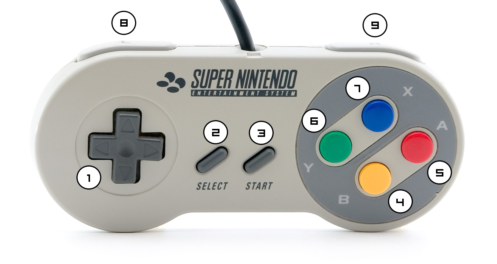

# retropie

This repo is:

* Instructions for how to set up a [RetroPie](https://retropie.org.uk/) machine from scratch
* A collection of scripts to manage launchers for ports such as `chromium-browser` which run inside [EmulationStation](https://emulationstation.org/)
* `cron` configuration with `rclone` to automatically back up saved games and roms

## Hardware

* [Raspberry Pi 3B+](https://www.amazon.de/-/en/gp/product/B07BDR5PDW/ref=ppx_yo_dt_b_asin_title_o04_s00?ie=UTF8&psc=1)
* [Raspberry Pi tall case](https://www.amazon.de/-/en/gp/product/B017SZ3T66/ref=ppx_yo_dt_b_asin_title_o02_s00?ie=UTF8&psc=1)
* [32GB microSD card](https://www.amazon.de/-/en/gp/product/B06XYHN68L/ref=ppx_yo_dt_b_asin_title_o02_s01?ie=UTF8&psc=1)
* Right-angle [HDMI cable](https://www.amazon.de/-/en/gp/product/B076YB79DL/ref=ppx_yo_dt_b_asin_title_o03_s00?ie=UTF8&psc=1)
* Right-angle [USB Cable](https://www.amazon.de/-/en/gp/product/B07NSQ5859/ref=ppx_yo_dt_b_asin_title_o03_s00?ie=UTF8&psc=1)
* SNES-style [gamepads](https://www.amazon.de/-/en/gp/product/B01N59IUV5/ref=ppx_yo_dt_b_asin_title_o06_s00?ie=UTF8&psc=1)
* Apple [Magic Keyboard](https://www.apple.com/shop/product/MRMH2LL/A/magic-keyboard-with-numeric-keypad-us-english-space-gray)
* Apple [Magic Trackpad](https://www.apple.com/shop/product/MRMF2LL/A/magic-trackpad-2-space-gray)

## System setup

1. Download and install the Raspberry Pi [Imager](https://www.raspberrypi.org/software/)
1. Use this to flash the microSD card
1. `touch /Volumes/boot/ssh` to enable SSH on boot
1. `touch /Volumes/boot/wpa_supplicant.conf` to create WiFi configuration file
1. Add WiFi config as specified [here](https://www.raspberrypi.org/documentation/configuration/wireless/headless.md)
1. Insert microSD and run first boot
1. Change user `pi` password
1. `sudo apt-get install vim`
1. Copy SSH key to `~/.ssh/authorized_keys`
1. Run `sudo raspi-config` and...
   1. Change GPU memory to 128MB
   1. Disable the splash screen on boot
1. Edit `/boot/config.txt` and set:
   1. `hdmi_force_hotplug=1` - enables HDMI even if the connected TV is not yet switched on
   1. `hmdi_group=1` - Set CEC HDMI group
   1. `hdmi_mode=16` - Set HDMI default resolution on boot to 1920x1080 @ 60Hz
1. Install Rclone
   1. `curl https://rclone.org/install.sh | sudo bash`
   1. `rclone config`
   1. Follow instructions at https://rclone.org/dropbox/
      1. New Remote - `n`
      1. Remote Name - `Dropbox`
      1. Storage Type (Dropbox) - `9`
      1. `client_id` blank
      1. `client_secret` blank
      1. Advanced config - `n`
      1. Use auto config - `n` - Remote machine
      1. Paste results from desktop command `rclone authorize "dropbox"`
      1. Is this ok - `y`
      1. Quit config - `q`

## RetroPie setup
1. [Install RetroPie](https://retropie.org.uk/docs/Manual-Installation/#install-retropie)
1. Configure to boot into EmulationStation
1. Install [RetroPie-Extra](https://github.com/zerojay/RetroPie-Extra)

## Chromium setup
1. Run the Chromium ["Media Centre" script](https://blog.vpetkov.net/2020/03/30/raspberry-pi-netflix-one-line-easy-install-along-with-hulu-amazon-prime-disney-plus-hbo-spotify-pandora-and-many-others/)
1. Open `retropie_setup.sh` and select `Manage packages` > `Manage experimental packages` and install `chromium`.

## Steam Link setup
1. Follow these [instructions](https://uk.pcmag.com/gallery/123035/how-to-use-a-raspberry-pi-and-steam-link-to-stream-pc-games-to-your-tv)
1. Install Steam Link streaming on the host machine

## Set up this repo
1. `git clone git@github.com:skhg/retropie-custom.git`
1. `cd retropie-custom`
1. `./setup.sh`
1. Restart EmulationStation

# About: How does the chromium-launcher work?

EmulationStation has chromium installed as a port, as shown above in Chromium setup. Once Chromium starts, we need to be able to control it with a gamepad, meaning we also need configuration(s) for [QJoyPad](http://qjoypad.sourceforge.net/) which let us manipulate the cursor, and most importantly, to exit!

## QJoyPad layouts

The `.lyt` layout scripts under `/qjoypad3` are preconfigured using the UI but automatically deployed by `setup.sh`.

I found these layouts work quite well with my SNES-style controller:

### General browsing (Regular websites)

1. Mouse cursor
2. F4
3. Alt
4. 
5.
6. ⬇️
7. ⬆️
8. Left-click
9. Right-click

### YouTube TV (Designed for gamepad use)

1. ⬆️ ⬇️ ⬅️ ➡️
2. F4
3. Alt
4. 
5.
6.
7.
8.
9.

## Launcher sequence 

## Site/App-specific configuration

# References
SNES Controller image credit: [PJ](https://commons.wikimedia.org/wiki/User:PJ) @ Wikimedia, CC BY-SA 3.0
